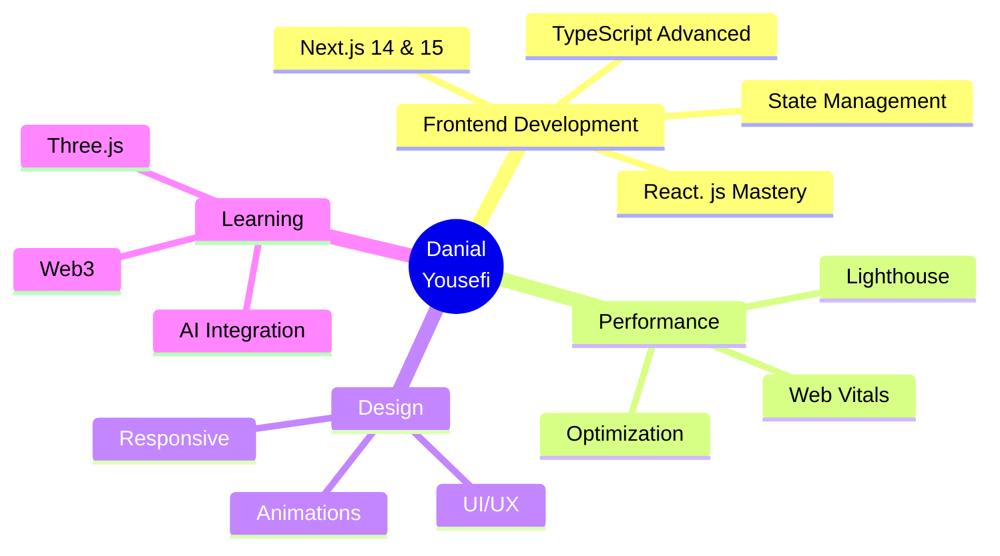

<div align="center">


<br/>

```ascii
╔══════════════════════════════════════════════════════════════╗
║                                                              ║
║   ____             _       _  __   __                  __ _  ║
║  |  _ \  __ _ _ __(_) __ _| | \ \ / /__  _   _ ___  _|_ _|  ║
║  | | | |/ _` | '_ \| |/ _` | |  \ V / _ \| | | / __|/ _ \|  ║
║  | |_| | (_| | | | | | (_| | |   | | (_) | |_| \__ \  __/|  ║
║  |____/ \__,_|_| |_|_|\__,_|_|   |_|\___/ \__,_|___/\___|_| ║
║                                                              ║
║          🌟 Crafting Digital Experiences with Code 🌟        ║
║                                                              ║
╚══════════════════════════════════════════════════════════════╝
```

<br/>

[](YOUR_PORTFOLIO)
[](YOUR_LINKEDIN)
[](YOUR_TWITTER)
[](mailto:YOUR_EMAIL)


</div>

##  About Me


```typescript
interface Developer {
  name: string;
  role: string;
  location: string;
  languages: string[];
  frameworks: string[];
  superpowers: string[];
  currentlyLearning: string;
  lookingFor: string;
  hobbies: string[];
}

const danial: Developer = {
  name: "Danial Yousefi",
  role: "Frontend Developer",
  location: "Iran 🇮🇷",
  
  languages: [
    "HTML5", "CSS3", "JavaScript (ES6+)", 
    "TypeScript", "Python"
  ],
  
  frameworks: [
    "React. js", "Next.js", "Tailwind CSS",
    "Redux", "React Query", "Zustand"
  ],
  
  superpowers: [
    "⚡ Lightning-fast UI Development",
    "🎨 Pixel-perfect Designs",
    "🚀 Performance Optimization",
    "♿ Accessibility Champion",
    "📱 Responsive Design Master"
  ],
  
  currentlyLearning: "Advanced Next.js & Web3",
  lookingFor: "Exciting Open Source Projects",
  
  hobbies: [
    "💻 Coding", "📚 Reading Tech Blogs",
    "🎮 Gaming", "☕ Coffee Enthusiast"
  ]
};

console.log("Welcome to my profile!  🚀");
```

<br clear="right"/>


##  Tech Arsenal

<div align="center">

### 🎨 Frontend Development

<table>
<tr>
<td align="center" width="96">

<br>React
</td>
<td align="center" width="96">

<br>Next.js
</td>
<td align="center" width="96">

<br>TypeScript
</td>
<td align="center" width="96">

<br>JavaScript
</td>
<td align="center" width="96">

<br>HTML5
</td>
<td align="center" width="96">

<br>CSS3
</td>
<td align="center" width="96">

<br>Tailwind
</td>
</tr>
<tr>
<td align="center" width="96">

<br>Redux
</td>
<td align="center" width="96">

<br>Sass
</td>
<td align="center" width="96">

<br>Bootstrap
</td>
<td align="center" width="96">

<br>Material UI
</td>
<td align="center" width="96">

<br>Vite
</td>
<td align="center" width="96">

<br>Webpack
</td>
<td align="center" width="96">

<br>Figma
</td>
</tr>
</table>

### 🛠️ Tools & Platforms

<table>
<tr>
<td align="center" width="96">

<br>GitHub
</td>
<td align="center" width="96">

<br>Git
</td>
<td align="center" width="96">

<br>VS Code
</td>
<td align="center" width="96">

<br>npm
</td>
<td align="center" width="96">

<br>Yarn
</td>
<td align="center" width="96">

<br>Postman
</td>
<td align="center" width="96">

<br>Vercel
</td>
</tr>
</table>

</div>


##  GitHub Analytics

<div align="center">
  


</div>


##  Connect With Me

<div align="center">

<a href="YOUR_LINKEDIN">
  
</a>
<a href="YOUR_TWITTER">
  
</a>
<a href="mailto:YOUR_EMAIL">
  
</a>
<a href="YOUR_PORTFOLIO">
  
</a>
<a href="YOUR_TELEGRAM">
  
</a>

<br/><br/>


</div>


## 🏆 GitHub Trophies

<div align="center">

[](https://github.com/ryo-ma/github-profile-trophy)

</div>


## 💼 Featured Projects

<div align="center">

<!-- به زودی پروژه‌های خودت را اینجا اضافه کن -->

<a href="https://github.com/danyal031/PROJECT_1">
  
</a>
<a href="https://github.com/danyal031/PROJECT_2">
  
</a>

</div>


## 🐍 Contribution Graph

<div align="center">

<picture>
  <source media="(prefers-color-scheme: dark)" srcset="https://raw. githubusercontent.com/danyal031/danyal031/output/github-contribution-grid-snake-dark.svg">
  <source media="(prefers-color-scheme: light)" srcset="https://raw.githubusercontent.com/danyal031/danyal031/output/github-contribution-grid-snake.svg">
  
</picture>

</div>


## 📈 Coding Stats

<div align="center">

<!--START_SECTION:waka-->
<!--END_SECTION:waka-->


</div>


## 🎯 Current Focus

<div align="center">



</div>


## 💡 Random Dev Quote

<div align="center">


</div>


## 🎵 Spotify Playing

<div align="center">

[](https://open.spotify.com/user/YOUR_SPOTIFY_USERNAME)

</div>


<div align="center">

### 💻 "First, solve the problem. Then, write the code." – John Johnson

### Show some ❤️ by starring ⭐ some of my repositories! 


</div>
